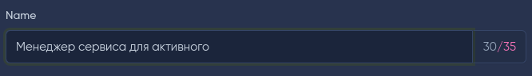

### Input extension - display the number of characters

Input extension - display the number of characters for MoonShine

### Installation

```
    composer require lee-to/moonshine-input-extension-char-count
```


```php
    use Leeto\InputExtensionCharCount\InputExtensions\CharCount;

    //
    Text::make('Field')
        ->extension(new CharCount()),
    // or
    Text::make('Field')
        ->extension(new CharCount(250)),
    // or
    Text::make('Field')
        ->extension(new CharCount(45,5)),
```
Parameters:
max - integer. The value can be empty. The maximum number of characters allowed.
min - integer. The value can be empty. The minimum allowed number of characters.

#### How does it look in the Admin Panel ?




> [!TIP]
> If the number of characters entered in the field is less than the min parameter or less than max*20%, then the maximum allowed number of characters will be highlighted in color.
